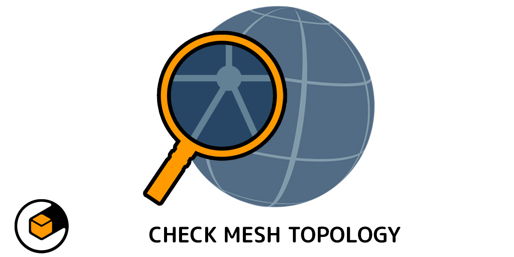
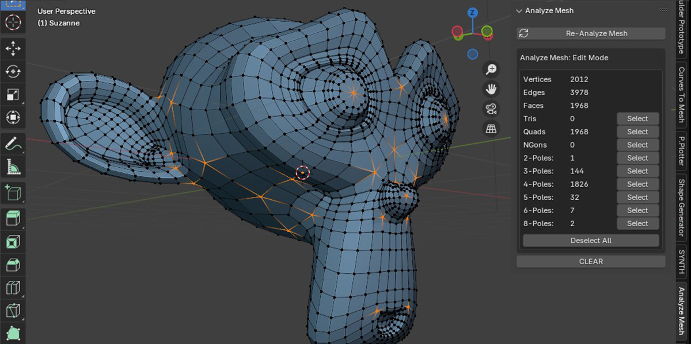
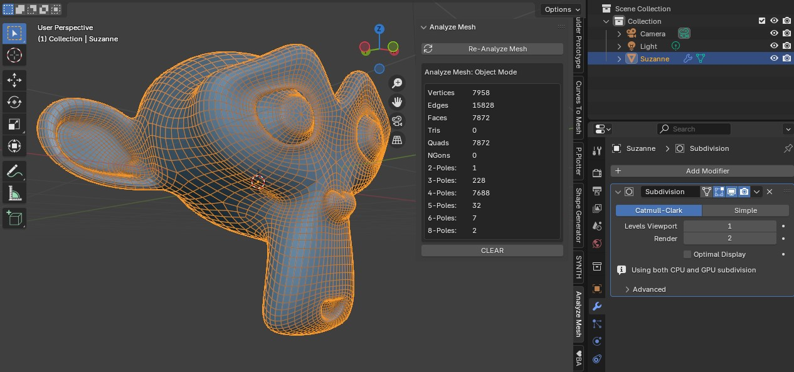

.. Analyze Mesh documentation master file, created by
   sphinx-quickstart on Mon Oct 21 20:29:17 2024.
   You can adapt this file completely to your liking, but it should at least
   contain the root `toctree` directive.

Analyze Mesh
========================================

---------------------------------
What is Analyze Mesh?
---------------------------------

`Analyze Mesh <https://blendermarket.com/products/analyse-mesh/>`_ is a free Blender Extension for 3D modelers who want to quickly check their mesh topology for `quads, tris, ngons <https://resources.turbosquid.com/training/modeling/tris-quads-n-gons/>`_ and edge `poles <https://resources.turbosquid.com/training/modeling/poles/>`_.

Originally part of `Quad Maker <https://blendermarket.com/products/quad-maker/>`_, Analyze Mesh is now available for free to provide a quick and easy way to check the topology of any mesh based object in Blender.

   Analyse Mesh at work in Edit Mode.

   Analyse Mesh at work in Object Mode.

.. toctree::
   :maxdepth: 2
   :caption: Contents:

---------------------------------
Features
---------------------------------

* Simply select the object and click the *Analyze Mesh* button from the side tab.

* The add-on will give you a snapshot of the total number of vertices, edges, faces, tris, quads, ngons, and poles in the mesh when in Edit or Object mode.

* Once analysed, select the different mesh elements from the panel (when in Edit mode).

* Analyze in Edit or Object modes:

    * In **Edit mode**, the add-on will analyze the base mesh elements.

    * In **Object mode**, the add-on will analyze the entire mesh with modifiers included.

* Refresh by clicking the *Re-Analyze Mesh* button again in order to save on performance.

---------------------------------
Using
---------------------------------

See the :ref:`Getting Started<quick_start>` Section for more information on how to use the add-on.

---------------------------------
Alternative Tools
---------------------------------

There are more sophisticated paid for tools available for analyzing mesh topology in Blender, such as `Meshanalyzer Pro <https://blendermarket.com/products/meshanalyzer-pro/>`_

.. toctree::
   :maxdepth: 1
   :caption: Contents:
   
   installation
   quick_start
   troubleshooting
   contact